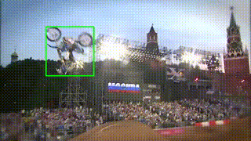

# Visual Object Tracking tensorflow-implementation

This repository is tensorflow implementation for the following papers.
Baseline codes are imported from [CFCF](https://github.com/egundogdu/CFCF) and siamese-fc[https://github.com/bertinetto/siamese-fc]

[1] E. Gundogdu et al., "Good Features to Correlate for Visual Tracking," in IEEE Transactions on Image Processing, vol. PP, no. 99, pp. 1-1. doi: 10.1109/TIP.2018.2806280
[2] L. Bertinetto et al., "Fully-Convolutional Siamese Networks for Object Tracking," ECCV, 2016
[3] J Valmadre et al., "End-to-end representation learning for Correlation Filter based tracking," CVPR, 2017



# Environments

This code is based on Python3 and tensorflow(tested on 1.4) with CUDA-9.0.

# Data preparation
You need to download [ILSVRC2015-VID](http://bvisionweb1.cs.unc.edu/ilsvrc2015/download-videos-3j16.php#vid) for training and [OTB2015](http://cvlab.hanyang.ac.kr/tracker_benchmark/datasets.html) for testing. If you are interested in pretraining on imagenet, you need to download it.

In order to load annotation data quickly, you first convert their format from xml to npz.
You can convert VID and ImageNet by doing
```
python generate_dataset.py --dataset=vid
python generate_dataset.py --dataset=imagenet
```
Please note that you may have to set other parameters (e.g. dataset path, output path)

# Running scripts
## check CF layer gradients
I found tensorflow autograd is able to compute gradient of correlation layeter. 
I also implemented custom gradient described in [1] and takes abs-max errors.
You can check by just doing
```
python check_gradients.py
```

# Pretrain on ImageNet

Many tracking algorithms use imagenet-pretrained models for their feature extractor.
I tried to do training by doing 
```
python imagenet_train.py
```
but please note that I couldn't achieve SOTA performance so far. 

# CFCF training
You can start to train your pretrained networks through CF layer by doing
```
python cfcf_train.py --ckpt_dir=pretrain_model_path --backbone=vgg --feat_layer=vgg_16/conv4/conv4_3
```

If you don't have any pretrained model, it's better to download from [here](https://github.com/tensorflow/models/tree/master/research/slim)

# Siamese-FC training
You also try training siamese-fc in a similar manner.
```
python siamesefc_train.py
```
The default `--ignore_pretrain` value is True, that means the network train from scratch.


# Hyper-parameter searching
Every training scripts have their parameter generation (See xxx_add_jobs.py)
You first edit `xxx_add_jobs.py` to set params and their search range and run it.
You will get several jobs under `./jobs/todo` directory and run them automatically by doing
```
./run.py --mode=monitor --gpu=GPU_ID
```

# Execute Traking (Testing)
When you finished your training, you can check your tracker performance by doing
```
python run_tracking.py --net_type=siamese --model=....
```

